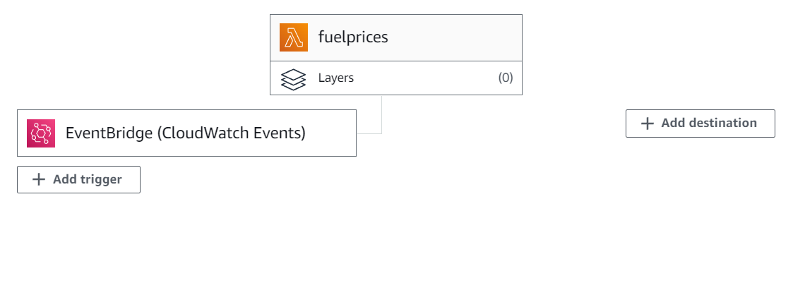

# Fuel Prices
AWS Lambda which scrapes the page to get information about today's fuel prices and then sends them in a table format to a specified email.

# Built With
- Java
- Spring
- jte
- jsoup

## Installation

## Usage

## License
[MIT](https://choosealicense.com/licenses/mit/)